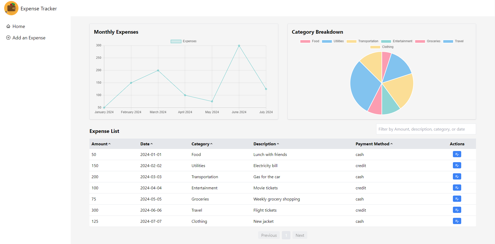
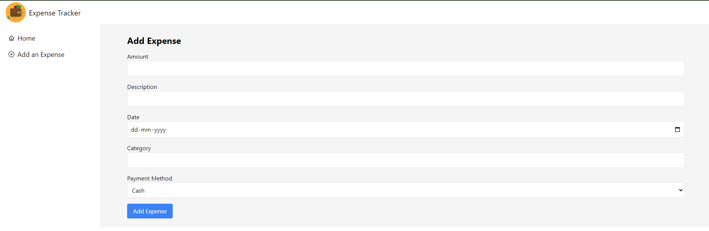

# Expense Tracker - (Create React App)

## Features
#### Add Expense: 
Users can add new expenses by entering the amount, description, date, category, and payment method (Cash or Credit). Categories can be auto-suggested based on previously used ones.
#### View Expenses:
 All added expenses are displayed in a list on the homepage, making it easy for users to see their spending history at a glance.
#### Category Suggestions: 
The app provides suggestions for previously used categories, improving the ease of entry when adding expenses.
#### Persistent Data: 
Expenses and categories are stored in the browser's localStorage, ensuring data is saved between sessions.
#### Responsive Design:
 The app is designed to work seamlessly across desktop and mobile devices.

 
 


## Installation
### Clone the repository:
```
git clone https://github.com/your-username/expense-tracker-app.git
```
### Install the dependencies:
```
npm install
```

### Run the application:
```
npm start
```


### Technologies Used
- React: For building the user interface.
- React Router DOM: For routing and navigation between pages.
- localStorage: For persisting expense data across browser sessions.
- Tailwind CSS: For styling the application with a modern and responsive design.